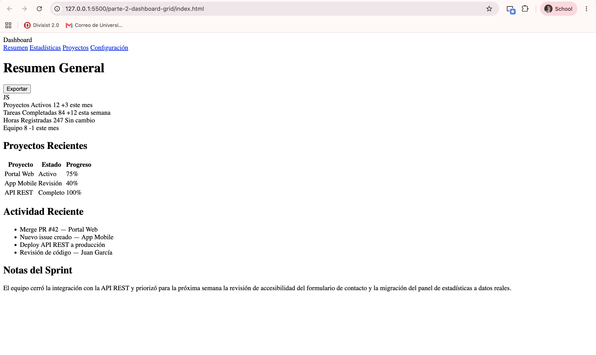
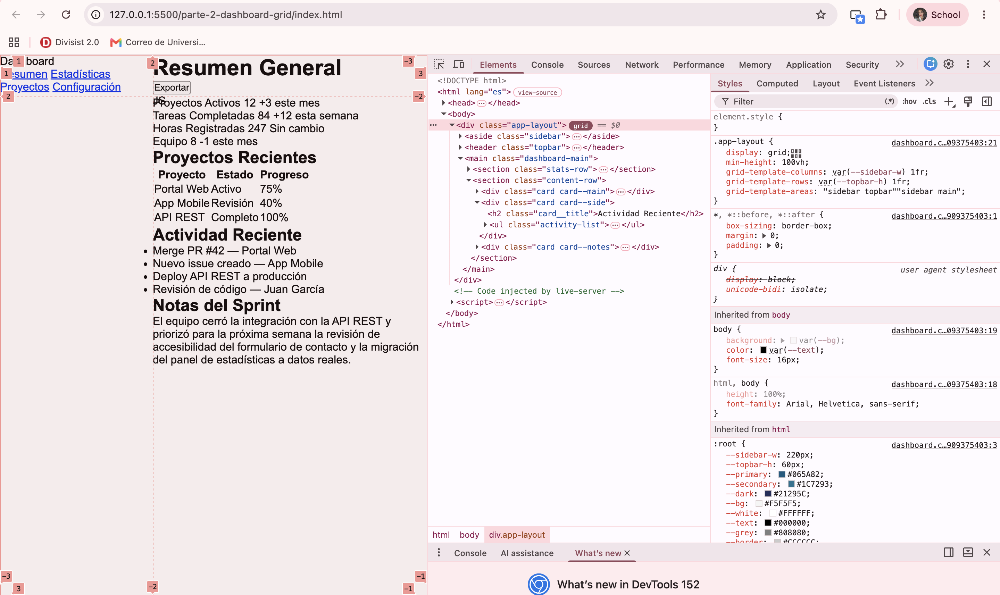
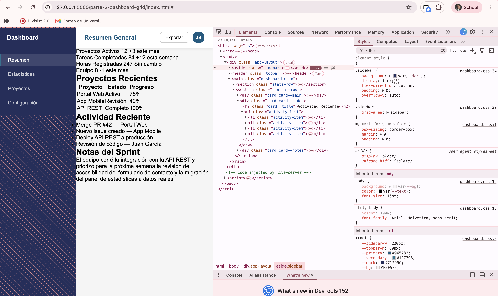
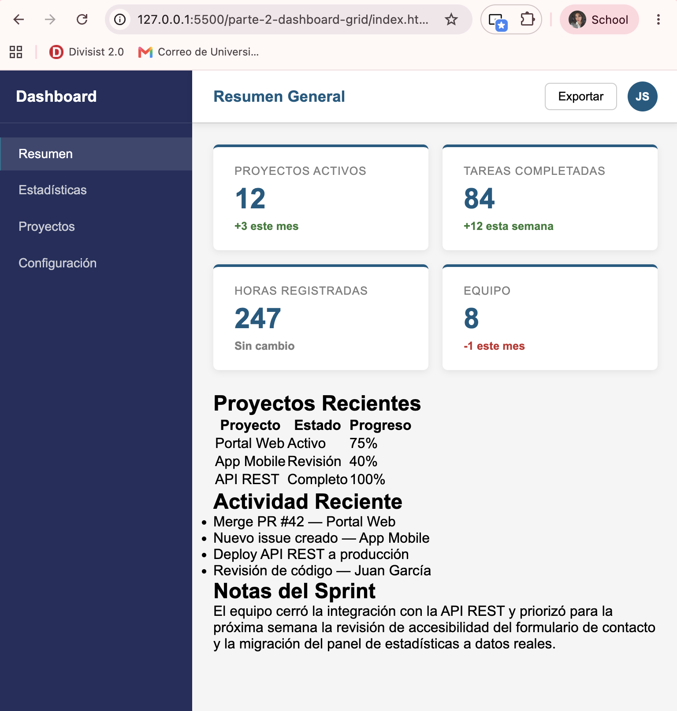
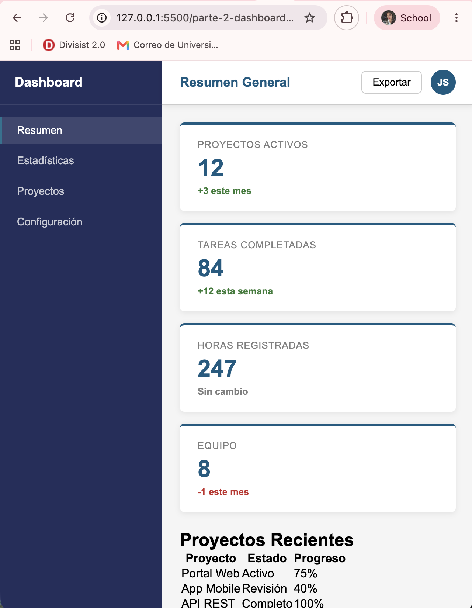
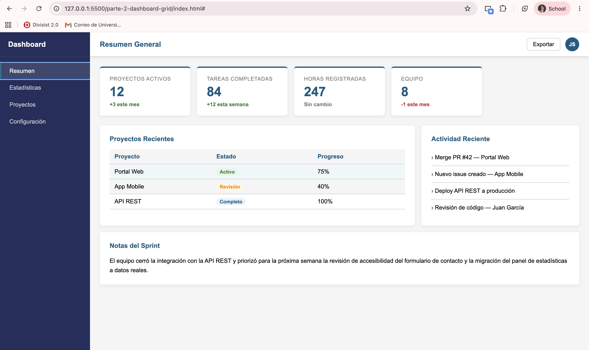
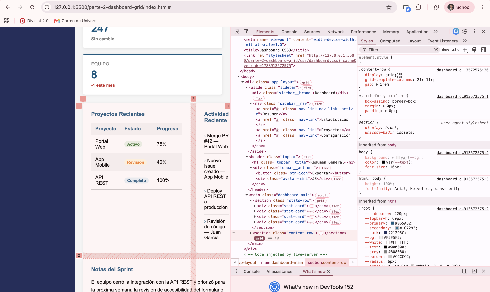
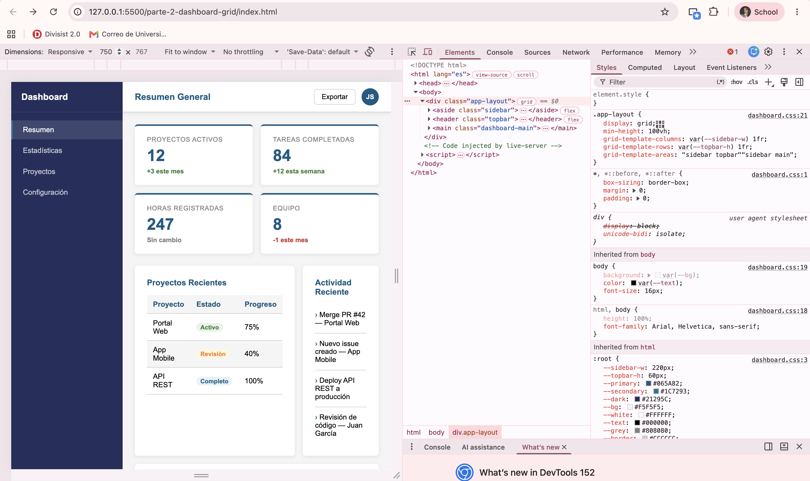
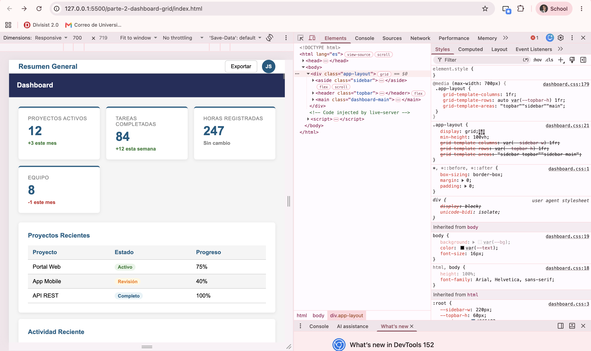

# Post-contenido — Unidad 3: CSS3 Básico

## Descripción
Repositorio del laboratorio de la Unidad 3 de Programación Web — Séptimo
Semestre. Contiene dos partes: página de perfil con selectores CSS
avanzados, Box Model y posicionamiento (`parte-1-perfil-css3/`) y dashboard
responsivo con CSS Grid y Flexbox (`parte-2-dashboard-grid/`).

## Parte 1 — Página de perfil
Página de perfil personal que implementa selectores CSS avanzados,
`box-sizing: border-box`, posicionamiento (`fixed`/`relative`/`absolute`),
una escala de espaciado con Custom Properties (`--space-3xs` a
`--space-3xl`), tipografía fluida con `clamp()` en el nombre de perfil y
formulario de contacto accesible con estados `:focus`. Ver
`parte-1-perfil-css3/`.

## Parte 2 — Dashboard con Grid y Flexbox
Dashboard responsivo con layout principal en CSS Grid
(`grid-template-areas`), sidebar y topbar en Flexbox, stat-cards con Grid
`auto-fill` responsivo, panel de contenido en proporción 2fr/1fr con un
tercer panel ("Notas del Sprint") posicionado mediante colocación
explícita de Grid (`grid-column: 1 / -1`), y tabla de proyectos con
franjas zebra vía `:nth-child(even)`. Sin frameworks CSS externos. Ver
`parte-2-dashboard-grid/`.

## Decisiones de diseño

### Parte 1 — Estrategia de especificidad para validación
Se eligió la **Estrategia A**: `input:invalid:not(:placeholder-shown)`.
Se prefirió sobre la Estrategia B porque resuelve por sí sola el problema
de mostrar los campos vacíos en rojo al cargar la página, sin necesitar
lógica adicional. Su especificidad (0,0,2,0) es igual a la de la regla
`:focus` del Paso 7, y al declararse después en el archivo gana el empate
sin necesidad de `!important`, dejando ambas reglas conviviendo sin
conflicto (evidencia en las capturas 07 y 08).

### Parte 2 — Breakpoint y estrategia de layout responsivo
Se eligió un breakpoint de **700px**, tras probar en DevTools que por
debajo de ese ancho el sidebar fijo de 220px dejaba muy poco espacio para
el contenido y el panel `2fr/1fr` se veía apretado. Se optó por la
**estrategia Grid** (redefinir `grid-template-areas`) en vez de Flex
porque conserva las áreas nombradas ya definidas en el Paso 2, evitando
tener que reordenar visualmente sidebar/topbar/main con la propiedad
`order`. La transición se verificó comparando el layout a 750px (normal)
y a 700px (apilado) — ver capturas 18 y 19.

## Cómo visualizar el proyecto
1. Clonar el repositorio: `git clone [URL-del-repo]`
2. Abrir la carpeta en Visual Studio Code
3. Clic derecho en `index.html` (de cada parte) → "Open with Live Server"

## Capturas de pantalla — Parte 1

**Paso 2 — HTML base sin estilos**
Estructura semántica de las 3 secciones (perfil, habilidades, contacto)
abriendo sin errores en el navegador.

**Paso 4 — Header fijo**
El header permanece pegado en la parte superior durante el scroll.

**Paso 5 — Tarjeta de perfil: `position: relative` en `.avatar-wrapper`**
Confirmación en DevTools de que el contexto de posicionamiento del badge
está acotado al avatar.

**Paso 5 — Tipografía fluida con `clamp()`**
El nombre de perfil escala de forma continua entre 375px y 1440px de
ancho de viewport, sin saltos ni tamaño fijo.

**Paso 6 — Habilidades con selectores avanzados**
Etiquetas de habilidad con colores diferenciados por modificador BEM y
combinador de hijo directo.

**Paso 7 — Formulario de contacto accesible**
Campos con reset, bordes y estados de foco correctamente estilizados.

**Paso 8 — Estado `:invalid` sin romper `:focus`**
El campo de correo muestra el borde de alerta cuando el valor es inválido
(sin "@"), tras haber sido escrito y perder el foco.

**Paso 8 — Verificación: ninguna regla usa `!important`**
Panel de Styles de DevTools mostrando la regla `input:invalid:not(:placeholder-shown)`
sin `!important` en ningún punto de la hoja de estilos.

**Paso 9 — Repositorio publicado en GitHub**
Repositorio `rivera-post1-u3` con commits descriptivos de la Parte 1.

**Vista completa de la página de perfil**

## Capturas de pantalla — Parte 2

**Paso 1 — HTML base del dashboard sin estilos**
Esqueleto semántico (sidebar, topbar, stats, tabla, actividad, notas)
abriendo sin errores, en flujo normal de bloque.

**Paso 2 — Grid principal de la aplicación**
Overlay de Grid en DevTools mostrando las áreas "sidebar", "topbar" y
"main" correctamente delimitadas mediante `grid-template-areas`.

**Paso 3 — Sidebar con Flexbox**
Overlay de Flexbox confirmando `display: flex; flex-direction: column`
en `.sidebar`, con los enlaces de navegación apilados verticalmente.

**Paso 4 — Topbar con Flexbox**
Topbar estilizada con `justify-content: space-between`, botón "Exportar"
y avatar circular alineados; las stat-cards ya muestran 2 columnas al
reducir el ancho de la ventana.

**Paso 5 — Stats row responsivo: 1 columna**
En una ventana angosta, `repeat(auto-fill, minmax(200px, 1fr))` reorganiza
automáticamente las 4 stat-cards en una sola columna, sin media queries.

**Paso 5 y 6 — Stats row en 4 columnas + tabla con zebra striping**
En escritorio, las 4 stat-cards se acomodan en una sola fila; la tabla de
proyectos muestra franjas zebra alternadas (`App Mobile` con fondo gris
claro) junto a los badges de estado con color.

**Paso 6 — Colocación explícita de Grid (`.card--notes`)**
Overlay de Grid sobre `.content-row` mostrando las líneas de columna 1,
2 y 3, con el panel "Notas del Sprint" ocupando desde la línea 1 hasta la
línea -1 en la fila inferior, debajo de los paneles principal y lateral.

**Paso 7 — Antes del breakpoint (750px)**
Layout normal: sidebar como columna angosta a la izquierda, stat-cards en
2 columnas, sin apilar.

**Paso 7 — Breakpoint activo (700px): layout apilado**
El sidebar cae como franja horizontal arriba del contenido; en el panel
de Styles se ve la regla `@media (max-width: 700px)` sobrescribiendo la
regla base de `.app-layout` (tachada), confirmando que la especificidad
del media query gana correctamente.

