# Post-contenido — Unidad 3: CSS3 Básico

## Descripción
Repositorio del laboratorio de la Unidad 3 de Programación Web — Séptimo
Semestre. Contiene dos partes: página de perfil con selectores CSS
avanzados, Box Model y posicionamiento (`parte-1-perfil-css3/`) y dashboard
responsivo con CSS Grid y Flexbox (`parte-2-dashboard-grid/`, en progreso).

## Parte 1 — Página de perfil
Página de perfil personal que implementa selectores CSS avanzados,
`box-sizing: border-box`, posicionamiento (`fixed`/`relative`/`absolute`),
una escala de espaciado con Custom Properties (`--space-3xs` a
`--space-3xl`), tipografía fluida con `clamp()` en el nombre de perfil y
formulario de contacto accesible con estados `:focus`. Ver
`parte-1-perfil-css3/`.

## Parte 2 — Dashboard con Grid y Flexbox
*Pendiente.* Esta sección se completará al finalizar la Parte 2 del
laboratorio (dashboard responsivo con CSS Grid, Flexbox, colocación
explícita de Grid y tabla con franjas zebra).

## Decisiones de diseño

### Parte 1 — Estrategia de especificidad para validación
Se eligió la **Estrategia A**: `input:invalid:not(:placeholder-shown)`.
Se prefirió sobre la Estrategia B porque resuelve por sí sola el problema
de mostrar los campos vacíos en rojo al cargar la página, sin necesitar
lógica adicional. Su especificidad (0,0,2,0) es igual a la de la regla
`:focus` del Paso 7, y al declararse después en el archivo gana el empate
sin necesidad de `!important`, dejando ambas reglas conviviendo sin
conflicto (evidencia en las capturas 07 y 08).

### Parte 2 — Breakpoint y estrategia de layout responsivo
*Pendiente.* Se completará junto con el desarrollo de la Parte 2.

## Cómo visualizar el proyecto
1. Clonar el repositorio: `git clone [URL-del-repo]`
2. Abrir la carpeta en Visual Studio Code
3. Clic derecho en `index.html` (de cada parte) → "Open with Live Server"

## Capturas de pantalla — Parte 1

**Paso 2 — HTML base sin estilos**
Estructura semántica de las 3 secciones (perfil, habilidades, contacto)
abriendo sin errores en el navegador.

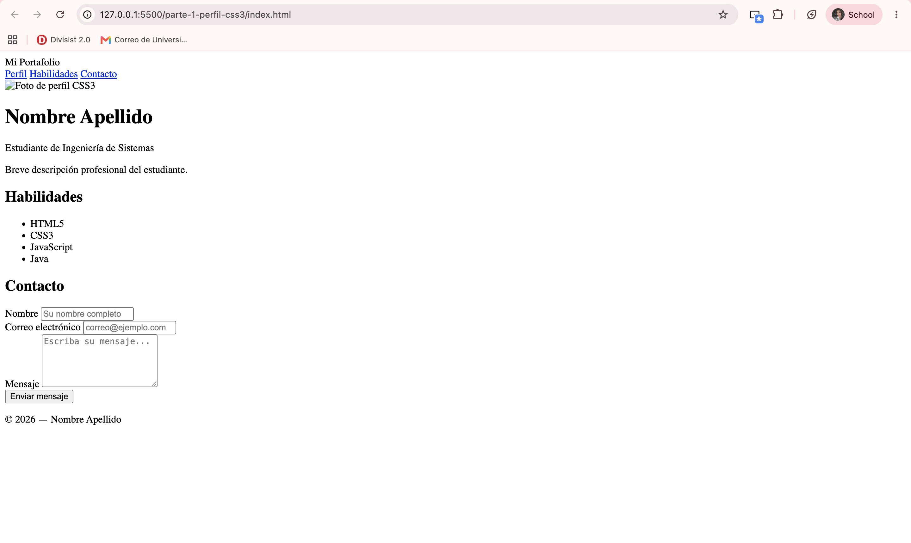

**Paso 4 — Header fijo**
El header permanece pegado en la parte superior durante el scroll.

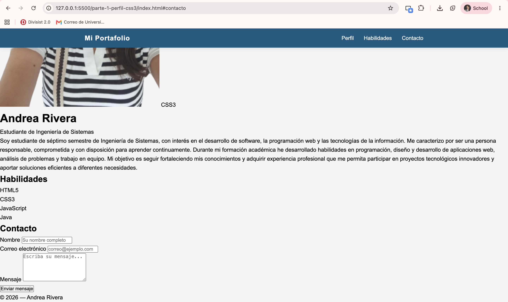

**Paso 5 — Tarjeta de perfil: `position: relative` en `.avatar-wrapper`**
Confirmación en DevTools de que el contexto de posicionamiento del badge
está acotado al avatar.

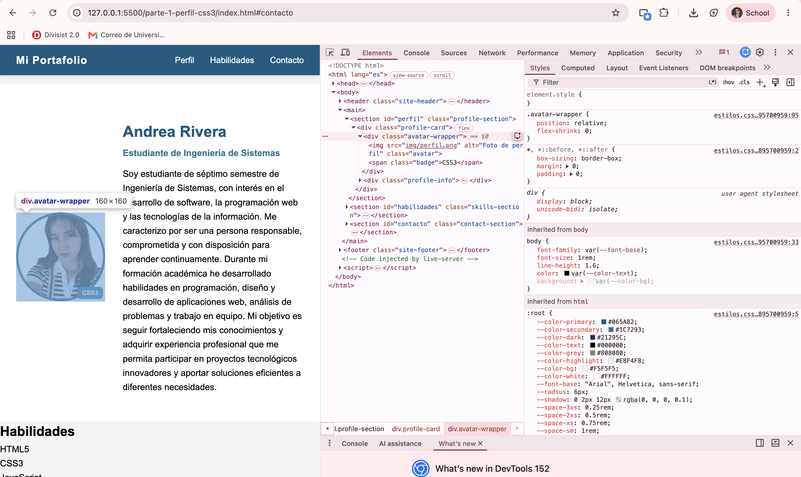

**Paso 5 — Tipografía fluida con `clamp()`**
El nombre de perfil escala de forma continua entre 375px y 1440px de
ancho de viewport, sin saltos ni tamaño fijo.

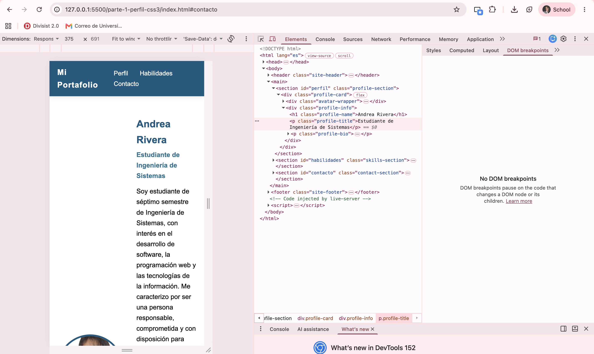
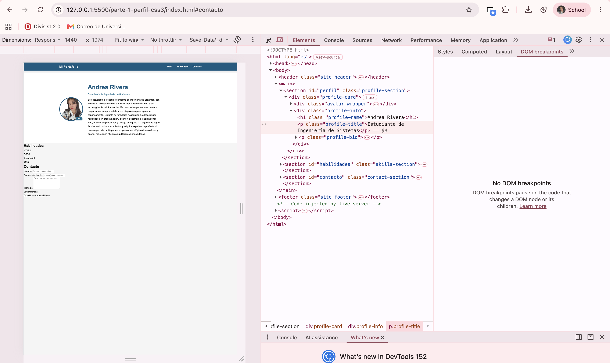

**Paso 6 — Habilidades con selectores avanzados**
Etiquetas de habilidad con colores diferenciados por modificador BEM y
combinador de hijo directo.

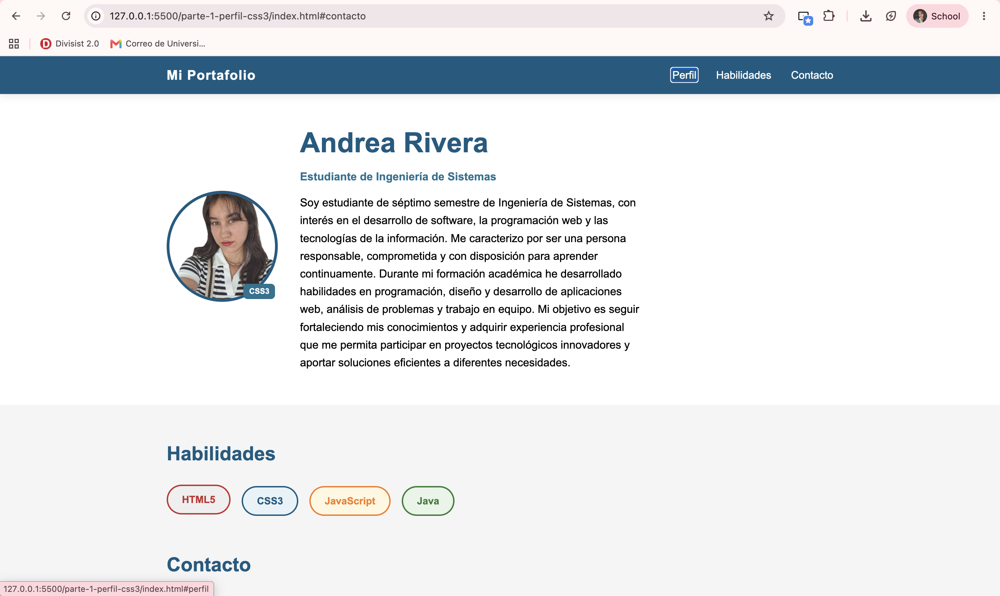

**Paso 7 — Formulario de contacto accesible**
Campos con reset, bordes y estados de foco correctamente estilizados.

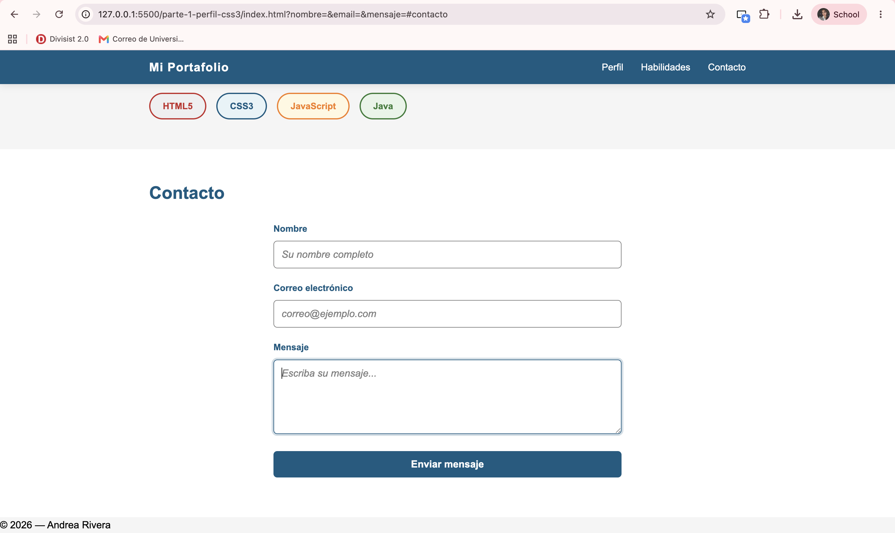

**Paso 8 — Estado `:invalid` sin romper `:focus`**
El campo de correo muestra el borde de alerta cuando el valor es inválido
(sin "@"), tras haber sido escrito y perder el foco.

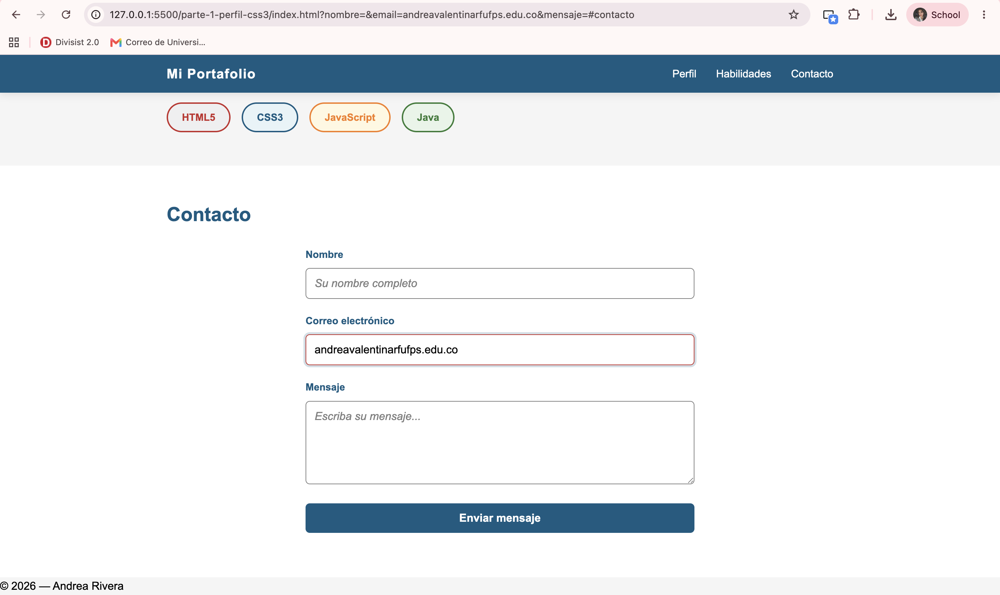

**Paso 8 — Verificación: ninguna regla usa `!important`**
Panel de Styles de DevTools mostrando la regla `input:invalid:not(:placeholder-shown)`
sin `!important` en ningún punto de la hoja de estilos.

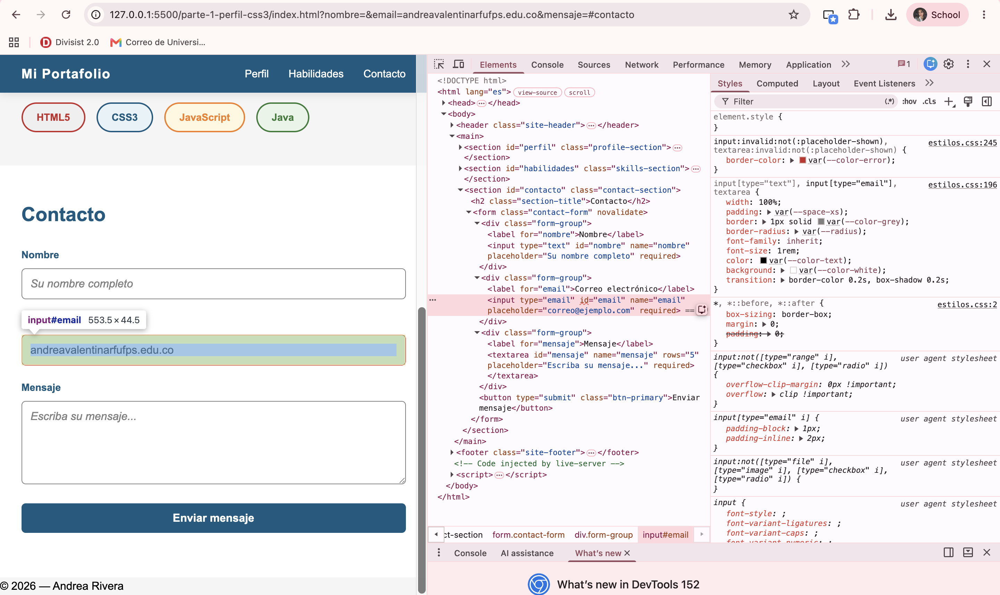

**Paso 9 — Repositorio publicado en GitHub**
Repositorio `rivera-post1-u3` con commits descriptivos de la Parte 1.

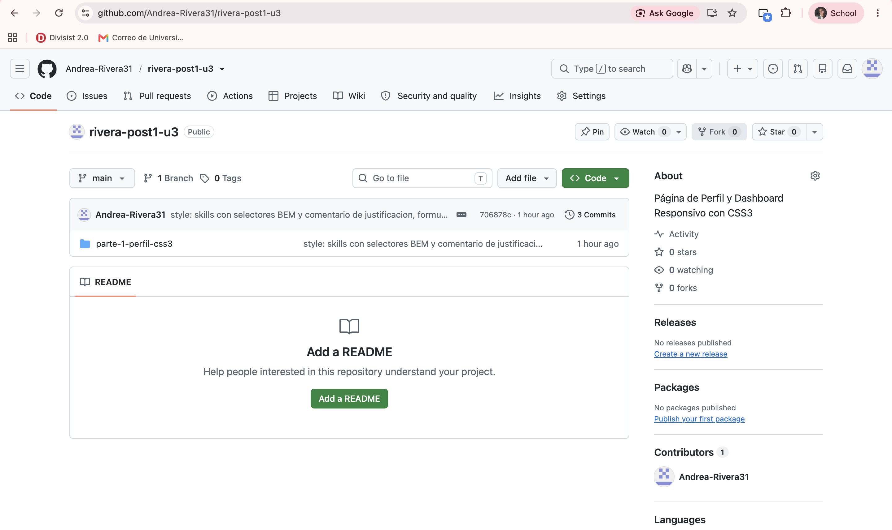

**Vista completa de la página de perfil**

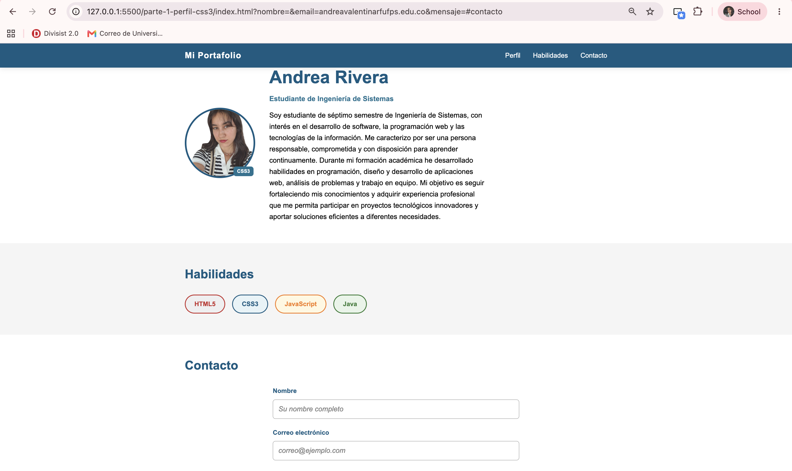